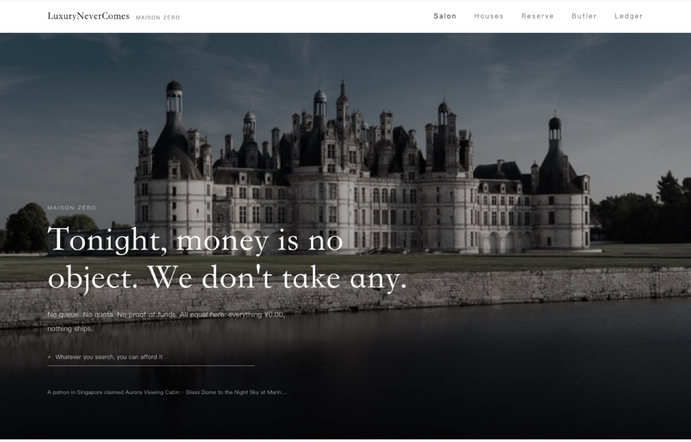
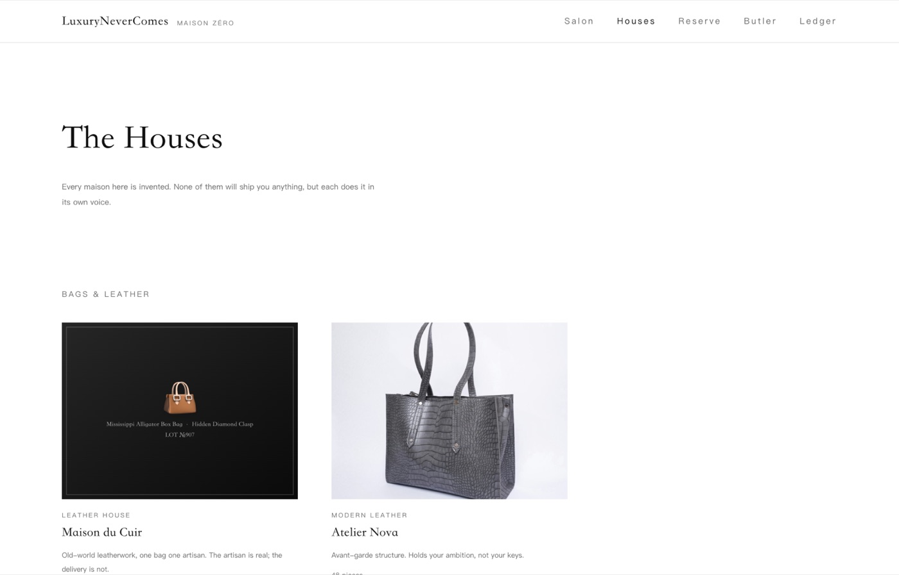
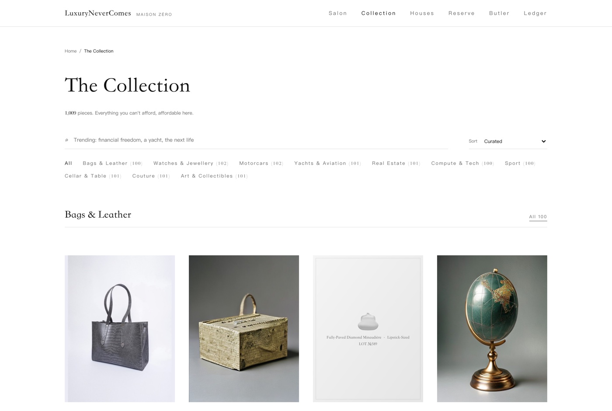
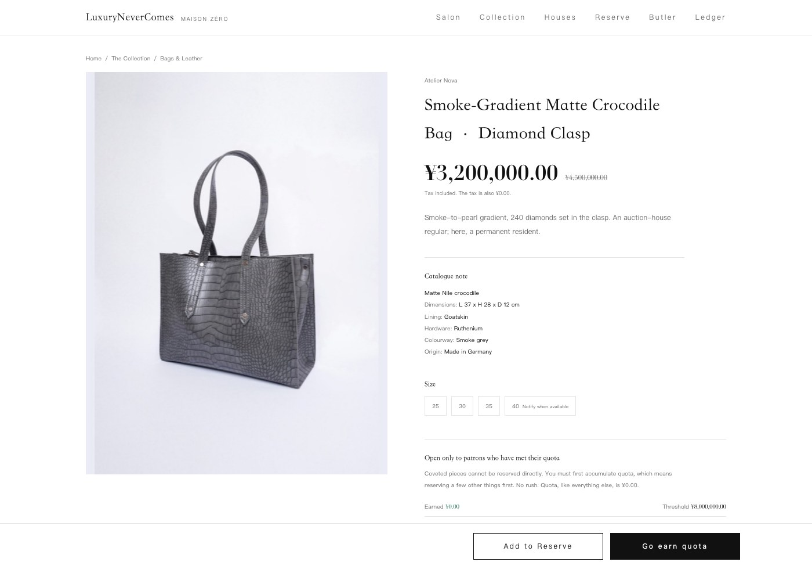

<div align="center">

# LuxuryNeverComes

### Buy everything. Keep everything.

*Finally affordable. Forever undelivered.*



</div>

A healing storefront for everything you cannot afford. Reserve crocodile bags, tourbillons, hypercars,
superyachts, private islands, ten-thousand-GPU clusters. Pay a solemn **¥0.00**, and nothing ever ships.
The dopamine lives in the wanting, not the having, and for luxury that logic holds best of all. Every
order's price is quietly banked in your **Downpayment Ledger**, so the money you did not spend adds up
to a fortune you did not lose.

Under the joke it is an ordinary thing: a satirical, front-end-only web app that runs entirely in the
browser, with no backend and nothing charged. The name is the promise; the tagline is the loophole. Both
halves of *Buy everything. Keep everything.* are literally true, because everything costs ¥0.00: you
walk out with the whole cart and every cent.

```bash
npm install && npm run dev      # http://localhost:5173
```

No hosted demo; clone to preview. Sister site:
[ParcelNeverComes](https://github.com/coindef/parcelnevercomes) for everyday goods, in the tradition of
dopamine shops like [FoodNeverComes](https://foodnevercomes.com).

---

## What it does

**Browse.** 1,009 pieces across 10 categories, each named by description and **never by a real brand**,
priced against the real world: a 76-metre superyacht at ¥680,000,000, a ten-thousand-GPU cluster at
¥2,180,000,000, a card holder at ¥8,800. Beyond the classics there is new-money luxury too, an hour of
quantum time ("your task is both done and not done"), satellite naming rights, a share of a fusion plant
("always fifty years away, and all of humanity waits with you"), a lifetime club membership ("the
waitlist starts at forty years; we waive it, you are not getting in anyway"). The catalogue runs in
chapters, dearest first, with search, filter and sort all held in the URL so the back button and a
shared link both behave.

**Reserve.** Add to your reserve, meet a quota, claim it now. The most coveted pieces refuse a direct
order: you must first reserve *other* things to build allocation, and the allocation is also ¥0.00, so
you spend nothing, repeatedly, to earn the right to spend nothing on the bag. Bespoke is offered on a
selection, tucked into an accordion where personalisation belongs, its surcharges shown and then struck
through to ¥0.00.

**Wait.** A white-glove butler files nine dispatch notes that unlock by real elapsed time: he pauses at
an Alpine pass to watch the snow for you, the captain waits for weather worthy of the cargo, and the
order is delivered to the showroom of your heart, climate-controlled, never depreciating. Chase it and
the butler replies. Long-press the forever-greyed "confirm receipt" for a Certificate of Genuine
Solitude.

**Send it onward.** Any piece can be sent as a gift: a plain link (`/?gift=...&from=You`) that opens as
a wrapped parcel on the recipient's screen, enters their ledger when accepted, and never arrives for
either of you. Wish lists share the same way. The certificate, the written price confirmation and the
monthly ledger summary all export as portrait cards sized for posting, because a shop like this spreads
by screenshot, and the screenshots should come pre-composed.

**Look back.** The Ledger totals everything *kept safe* (`¥380,000,000.00`, every comma spelled out),
converted into "≈ 190 first-tier downpayments" or "≈ many years of you, unharmed." Your first visit
hands you a *Carte Noire*, limit none, valid forever, not that checkout will ever need it.

<div align="center">



*The Houses: twenty-two invented maisons, each with a name, a temperament and a one-line history.*

</div>

## Shopping, simulated

The store is modelled on how luxury e-commerce actually behaves. Ten real houses were read where they
were readable (Cartier, Hermès, Dior, Louis Vuitton, Chanel, Van Cleef, Loro Piana, Net-a-Porter,
Mytheresa, Farfetch), then every claim tested against a pass built to refute it. Several did not survive,
and three overturned what the app already did.

**Colourway is never a decision.** Every colourway is a separate page with its own reference, confirmed
at six houses (Dior's `_M900` is a house-wide black code; Chanel keeps style `A01112` and varies the
suffix). A leather picker on a bag page is not a luxury pattern but an invention, and ours repeated
identically across all 100 bags, which is exactly what the sameness felt like.

**A product page asks for almost nothing.** Decisions per page run 0 to 3, and the mode is 1: the size.
Hermès Petit h asks for nothing at all, its selector reading "Color, Random selected" over the line "The
color of the product is a surprise!" So the variety in real luxury does not come from a configurator. It
comes from the *data*: every piece has its own reference, material, dimensions and colourway. That is
what [src/lib/spec.ts](src/lib/spec.ts) derives, deterministically from each piece, giving **1,009
distinct specification sheets** where the configurator gave 37 repeated ones.

**Size is never priced inside a selector.** Either one price spans the whole run (Cartier's LOVE is one
number from 15 to 21cm, while conceding that the diamond count changes) or the size is a separate
product you navigate to (Hermès prices the Birkin 25/30/35 apart). Either way the page shows one
finished number, so 210 pieces ask for a size and 799 ask nothing at all.

Also adopted, each because a real house does it: breadcrumbs; a live count on every filter value with
empty categories hidden; a single "Clear all" rather than filter chips; house, name and price on the
card with the piece's own material beneath. A CTA stack routes to a human four ways, because in real
luxury the sale rarely closes online, and here none of them close. Pagination is **load more with a
viewed count, not infinite scroll**.

The counter-evidence was kept too. The Nielsen Norman Group documents shoppers *punishing* maisons for
withholding information, and found Tom Ford's light-grey all-caps text undermined its luxury positioning:
an independent corroboration of this repo's own contrast floor and its ban on eyebrow labels (the small
capitalised strap-lines above a heading). Steal the restraint, not the withholding.

<div align="center">



*The catalogue in chapters, dearest first, every filter value carrying a live count. Pieces awaiting
photography show a paper catalogue plaque rather than a gap.*



*One decision, then the numbers. Each size carries its own availability; the reference number sits small
and unexplained at the foot of the page, where Cartier puts it.*

</div>

## Photography

Every lot wants three views (full, reverse, from above), so full coverage is **2,952 images**. The free
lane ([Pollinations](https://pollinations.ai), Flux, no key) allows **one request at a time per IP** and
throttles the longer it runs, from ~40s an image toward several minutes, so the full set is a job of
days and being unfinished is its normal state, not a fault. The pipeline is therefore prioritised by
visibility and fully resumable: it skips whatever is on disk, and the seed is a pure function of the
product id, so a view made today still matches one made next week.

```bash
npm run images:plan      # what it would make, and in what order
npm run images           # generate; Ctrl-C whenever, re-run to continue
npm run images:manifest  # rescan public/img → src/lib/imageManifest.ts
npm run images:aspect    # pad any legacy photo that is not yet 3:4
```

Four rules live in [scripts/art-direction.mjs](scripts/art-direction.mjs), and each is there because the
obvious alternative failed:

1. **One seed per piece, shared by all three views.** Separate seeds draw three *different* handbags.
2. **The angle goes first.** At the end of the prompt it is ignored and you get a frontal hero shot.
3. **Never name `hand` or `people`, not even to forbid them.** Diffusion models do not negate, they
   render: "hand stitching" put a literal hand in the frame. Catalogue names hid roughly ninety of these
   (`Hand-Built`, "A Global Handful", "Logo-Free Edition", a clock's "Hands"); all are scrubbed.
4. **Whole objects only, no macro details.** Make "the clasp" the subject and the model forgets the bag
   and draws a ring.

Pieces that *are* a person (a butler, a coach, a chef) are never generated, because that means generating
a face; they keep the plaque. Real photography (Unsplash, CC BY) is kept too, **but only where it fits
the frame**. Everything is shown at **3:4**, the catalogue's page shape, so nothing is cropped to fit.
The older photographs did not arrive at 3:4 (they run 900x506 to 600x900), and there are two honest ways
to make one fit: pad it, or replace it. Padding grows the canvas with the photo's own background colour
and leaves the picture untouched, which works when the subject already fills the frame, but a landscape
shot padded into a tall frame ends up floating small (one tiara sat at 20% against a native piece's 44%,
and *that* is what looks wrong in a grid, not any stretching). So the rule is measured: a photo that fills
at least 75% of the 3:4 frame is padded and kept; one that fills less is regenerated at 3:4 instead, and
its attribution retires with it.

## Design, Cold Luxury

True paper white `#FFFFFF`, ink black `#111111`, a cool hairline `#E5E5E5`, and private-bank green
`#1F6B4A`. **There is only one colour on the whole site, and it is the green**, appearing only on the
saving-and-soothing side: payable ¥0.00, kept safe, the ledger. The rest is black and white.

A full-bleed hero carries the headline; product cards are borderless and left-aligned, with a great deal
of whitespace. **The luxury is in the restraint, not the ornament.** Prices are
set in a Didone face with every digit and comma spelled out, because the length of the commas is the
dopamine; motion is expensively slow, never bouncy. The page closes the way a maison closes one, with a
mailing list for the pieces that will not arrive, a few quiet columns, and the fine print. The full
doctrine, including the two visual eras this replaced, is in [DESIGN.md](DESIGN.md).

## Run it

```bash
npm install
npm run dev        # http://localhost:5173
```

```bash
npm run build      # type-check + production build → dist/
npm run preview    # preview the production build
npm run lint       # oxlint
```

Vite, React 19, TypeScript, Tailwind CSS v4, React Router. State lives entirely in the browser's
`localStorage` (cart, orders, the ledger): no backend, no payment, no data collected. *Your fortune
exists only on this device; we cannot see it, and neither can your relatives.*

Which pieces have photographs, and how many views each, is settled at build time in
[src/lib/imageManifest.ts](src/lib/imageManifest.ts) (generated and committed). Four in five pieces have
no photograph yet, so letting the browser discover that through failed requests would mean hundreds of
doomed 404s on every visit to the catalogue. Any static host works: Vercel imports as-is
([vercel.json](vercel.json) sets the SPA fallback and image caching), Netlify uses
[public/_redirects](public/_redirects), and elsewhere you route all paths back to `index.html`.

## Not a real store

An entertainment and mood-lifting toy, not a shop. Every product, price, review, atelier and butler is
fictional, with no affiliation to or endorsement from any real brand, and every name is a category
description. Nothing is charged, no address is taken, no personal data is collected.

Code is under [MIT](LICENSE). Images are either photographs (Unsplash, CC0, CC BY / CC BY-SA) or
generated with Flux, and every one is inspected by eye for readable brand marks before it ships.
Attribution for the photographs lives in [src/lib/credits.ts](src/lib/credits.ts) and renders at
`/about`; [scripts/ai-sourced.json](scripts/ai-sourced.json) records which pieces are generated, which is
also what keeps the pipeline from ever painting over someone's photograph.

## Thanks

To FoodNeverComes, which went first, and to everyone who has ever looked at a yacht in their cart and
sighed, softly, late at night.
